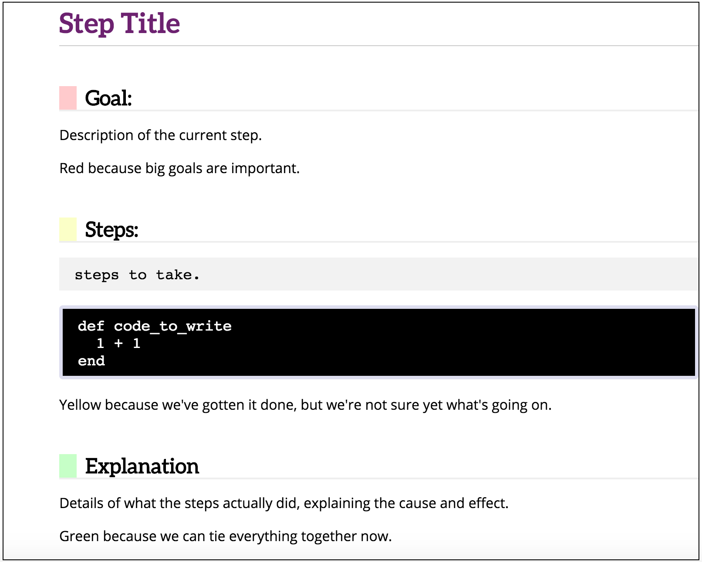

# 介绍

## The IPFS Primer

本教程包含一系列教程，解释IPFS、Merkle树和去中心化的Web。它是作为一本[gitbook](https://www.gitbook.com/about)编写和维护的，因此人们可以以多种格式阅读它。

本书的GitHub仓库位于 [https://github.com/ipfs-shipyard/ipfs-primer](https://github.com/ipfs-shipyard/ipfs-primer) 。

## 得到帮助

在这些教程中，如果你有任何问题，请随时在[IPFS论坛](https://discuss.ipfs.io)或在[chat.freenode.net上的\#ipfs频道](irc://chat.freenode.net/%23ipfs)中提出。我们有一个很大的、活跃的社区，他们使用这些场所作为我们寻求和提供支持的主要场所。

### 教程

教程包含关于

1. [Downloading and Installing IPFS](install-ipfs/)
2. [Files on IPFS](files-on-ipfs/)
3. [Going Online - Joining the Distributed Web](going-online/)
4. [Interacting with the Classical \(HTTP\) Web](classical-web/)
5. [The Myriad ways to Access and Distribute IPFS Content](avenues-for-access/)
6. [Making Changes on the Permanent Web](publishing-changes/)
7. [Merkle Trees and the IPFS DAG](ipfs-dag/)
8. [Dynamic Content on IPFS](dynamic-content/)

   有关教程的完整列表，请查看[目录](https://github.com/CoreyLin/ipfs-primer/tree/bab50d1b22ae297b07c3c7d729b0ad2ba500b795/SUMMARY.md)。

### 概念

* 密码哈希和内容可寻址性
* 验证图（Authenticated Graphs）
* 将文件转换为树
* 将任何数据转换为树
* 在DHT上发布hashes
* 从点对点网络获取数据
* 不变性:添加到树的“改变”
* CRDTs
* Pubsub
* 认证流\(Authenticated Streams，使用pubsub\)

### 格式

每个教程都是一组_课程_，都使用了一种受[Railsbridge Curriculum](http://curriculum.railsbridge.org/intro-to-rails/)启发的格式。每节课都宣布一组_目标_，或[学习目标](http://edglossary.org/learning-objectives/)，然后列出_步骤_或活动，最后给出一个_解释_，回顾你已经做了什么，并将这些活动与课程的目标联系起来。每节课的格式是这样的:

### Note for Contributors

For a concise explanation of Learning Objectives \(which we're calling _Goals_ in this book\), read UC Denver's [Assessment & Instructional Alignment Tutorial](http://www.ucdenver.edu/faculty_staff/faculty/center-for-faculty-development/Documents/tutorials/Assessment/module3/index.htm). Try to make your learning objectives [Specific, observable and measurable](http://www.ucdenver.edu/faculty_staff/faculty/center-for-faculty-development/Documents/tutorials/Assessment/module3/good_objectives.htm) and heed their tip to use the list of verbs in the [taxonomy table worksheet](http://www.ucdenver.edu/faculty_staff/faculty/center-for-faculty-development/Documents/tutorials/Assessment/documents/examples_verbs_cognitive_process_level.pdf) to help you choose observable behaviors for your course learning objectives.

To build the HTML, PDF, epub and mobi versions of the book with one command, run `./build-book.sh`

## Contributors

This primer was created by @flyingzumwalt. The contents of these tutorials were initially pulled from documentation in the first-generation documentation homed on the IPFS website and the \(now-inactive\) IPFS examples git repository. \(Find them in their new homes on [docs.ipfs.io](https://docs.ipfs.io), particularly the ["Usage ideas and examples"](https://docs.ipfs.io/concepts/usage-ideas-examples/) section.\)

Contributors to those original docs included

* @whyrusleeping
* @jbenet
* @lgierth
* @lynnandtonic
* @wraithgar
* @adambrault
* @donothesitate
* @djdv

  plus a long list of [contributors](https://github.com/ipfs/examples/network/members) to the original examples repository

