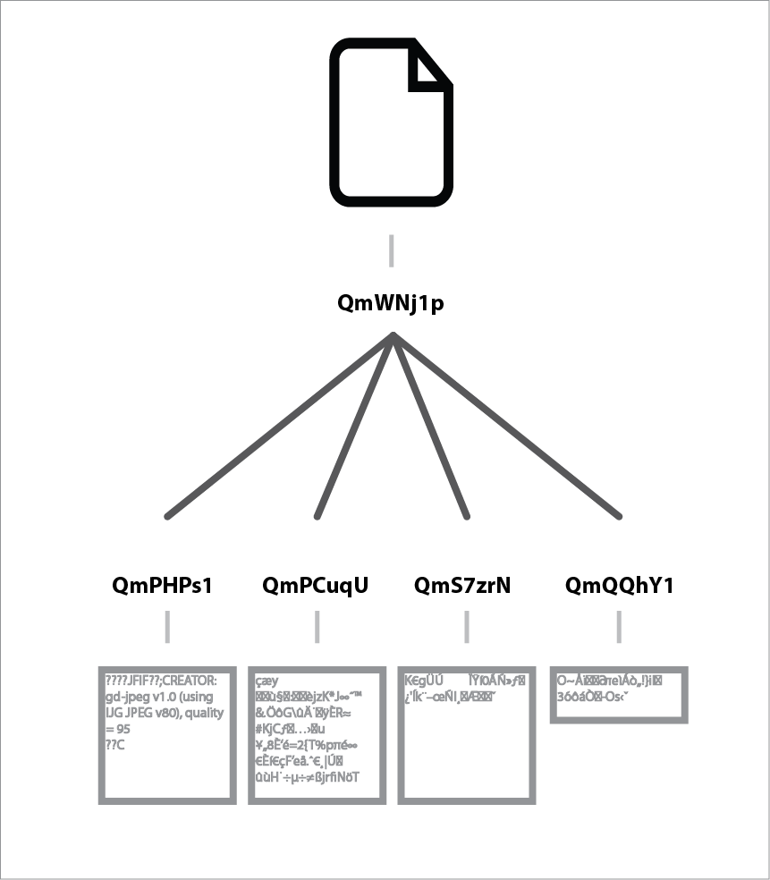

# 课程:把一个文件转换为一个哈希树

## 目标

* 解释IPFS如何将文件表示为Merkle树
* 探索IPFS中组成一个文件的Merkle树块

## 步骤

### 步骤1:下载示例文件并将其添加到IPFS中

对于本课，我们需要一个大于256kb的文件。下载此图片:[tree-in-cosmos.jpg](https://raw.githubusercontent.com/ipfs-shipyard/ipfs-primer/master/samples/tree-in-cosmos.jpg) (863kb)

保存为“tree-in-cosmos.jpg”，然后添加到IPFS中

```bash
$ ipfs add tree-in-cosmos.jpg
added QmWNj1pTSjbauDHpdyg5HQ26vYcNWnubg1JehmwAE9NnU9
```

### 步骤2:

让我们看看IPFS是如何通过将内容的哈希传递给`ipfs ls`命令来在内部表示该文件的:

```text
ipfs ls -v QmWNj1pTSjbauDHpdyg5HQ26vYcNWnubg1JehmwAE9NnU9
Hash                                           Size   Name
QmPHPs1P3JaWi53q5qqiNauPhiTqa3S1mbszcVPHKGNWRh 262158
QmPCuqUTNb21VDqtp5b8VsNzKEMtUsZCCVsEUBrjhERRSR 262158
QmS7zrNSHEt5GpcaKrwdbnv1nckBreUxWnLaV4qivjaNr3 262158
QmQQhY1syuqo9Sq6wLFAupHBEeqfB8jNnzYUSgZGARJrYa 76151
```

这将返回一串哈希。这与[将文件内容添加到ipfs的课程](../files-on-ipfs/add-and-retrieve-file-content.md)所发生的情况不同，在那一课中，你只得到一个哈希返回。这是因为ipfs将文件分解为每个约256kb的内容块，然后使用一个 **哈希树** 表示它们如何组合在一起。

这是IPFS如何使用哈希树(也称为 **Merkle DAGs** )来表示信息的一个例子。

这种哈希树的正式名称是 **Merkle DAG** ——这是因为这种类型的数据结构的技术术语是一个有向无环图(Directed Acyclic Graph,DAG)，是一位名叫Ralph Merkle的数学家发明的。因此:Merkle DAG，或merkledag。



在本例中，文件`QmWNj1pTS...`的哈希是一个DAG中包含4个子块的 **根块** 的哈希。`ipfs ls`的输出列出了这些子块及其大小。

有时子块有它们自己的子块。这时，一个Merkle DAG看起来就像一棵树。这个图显示了一个有三层子块的一个Merkle DAG。


_你觉得它看起来像一棵倒立的树吗？_

### 步骤3:探索哈希树

`ipfs refs`和`ipfs object links`命令是获取树中子块列表的其他方法。

试试这些:

```bash
$ ipfs refs QmWNj1pTSjbauDHpdyg5HQ26vYcNWnubg1JehmwAE9NnU9
ipfs object links -v QmWNj1pTSjbauDHpdyg5HQ26vYcNWnubg1JehmwAE9NnU9
```

如果子块中有更多的子块，你就可以使用这些命令来获得这些子块的子块的哈希。例如

```bash
$ ipfs object links -v QmPHPs1P3JaWi53q5qqiNauPhiTqa3S1mbszcVPHKGNWRh
```

但这没有返回任何东西，因为没有子块在`QmPHPs1P...`中

### 步骤4:从IPFS中读取内容

如果使用`ipfs cat`从ipfs中读取内容，它将处理从哈希树重新组装这个文件。例如，下面的命令将从ipfs中读取示例图像，并将内容写入一个名为"copy-of-tree-in-cosmos.jpg"的新文件中。运行该命令，然后打开新文件，以确认图像仍然完好无损。

```bash
$ ipfs cat QmWNj1pTSjbauDHpdyg5HQ26vYcNWnubg1JehmwAE9NnU9 > copy-of-tree-in-cosmos.jpg
```

### 步骤5:分别检查各个块

使用这些命令检查哈希树中的块:

* `ipfs block stat`将告诉你一个给定块的确切大小(不包括它的子块)

* `ipfs refs`将告诉你该块的所有子块。对于在一个给定对象的每个子块上运行脚本，这是一个更合适的命令。

* `ipfs ls`或`ipfs object links`将显示所有子对象及其大小。

### 步骤6:读取一个子块的内容

在某些情况下，你希望从一颗树中检索子块。你可以使用`ipfs cat`来实现这一点。你可以用我们图像中的子bocks来测试。

```bash
$ ipfs cat QmPHPs1P3JaWi53q5qqiNauPhiTqa3S1mbszcVPHKGNWRh
```

输出将类似于此，因为它是图像内容，而不是文本:

```text
<FF><D8><FF><E0>^@^PJFIF^@^A^A^@^@^A^@^A^@^@<FF><FE>^@;CREATOR: gd-jpeg v1.0 (using IJG JPEG v80), quality = 95
<FF><DB>^@C^@^B^A^A^A^A^A^B^A^A^A^B^B^B^B^B^D^C^B^B^B^B^E^D^D^C^D^F^E^F^F^F^E^F^F^F^G  ^F^G     ^G^F^F^H^K^H   


???w!1AQaq"2B????    #3R?br?
$4?%?&'()*56789:CDEFGHIJSTUVWXYZcdefghijstuvwxyz??????????????????????????????????????????????????????????????????????????
,?y?ՠ|ѿiMgᦧk?_?WN??W????F!%T 8?W???I$uZ?????K?\?olng?H|?????@?#8?En?1??;
```

### 步骤7：手工组装这些块

`ipfs cat`允许你读取每个块的内容，还允许你 _连接_ 许多输入。这意味着我们可以使用`ipfs cat`通过将所有子块的哈希传递到该命令来重新构建我们的图像。

```bash
ipfs cat QmPHPs1P3JaWi53q5qqiNauPhiTqa3S1mbszcVPHKGNWRh QmPCuqUTNb21VDqtp5b8VsNzKEMtUsZCCVsEUBrjhERRSR QmS7zrNSHEt5GpcaKrwdbnv1nckBreUxWnLaV4qivjaNr3 QmQQhY1syuqo9Sq6wLFAupHBEeqfB8jNnzYUSgZGARJrYa > manually-rebuilt-tree-in-cosmos.jpg
```

## 额外的步骤

有些事情可以尝试:

* 编写一个脚本，使用`ipfs ref`和`ipfs cat`从一个文件的根哈希重新构建该文件

## 解释

Merkle DAGs是IPFS的核心概念。Merkle DAGs也是git、比特币和dat等技术的核心。

哈希树由 _内容块_ 组成，每个内容块由其加密哈希标识。你可以使用它的哈希来引用这些块中的任何一个，这允许你使用这些子块的哈希来构建引用它们的“子块”的块树。

`ipfs add`命令将从你指定的文件中的数据创建一个Merkle DAG。在执行此操作时，它遵循unixfs数据格式。这意味着你的文件被分解成多个块，然后用“链接节点link nodes”将它们捆绑在一起，排列成类似一颗树的结构。一个给定文件的“哈希”实际上是DAG中根(最上)节点的哈希。对于一个给定的DAG，可以使用`ipfs ls`轻松查看它下面的子块。

## 接下来的步骤

接下来，学习[加密哈希](crypto-hash.md)

