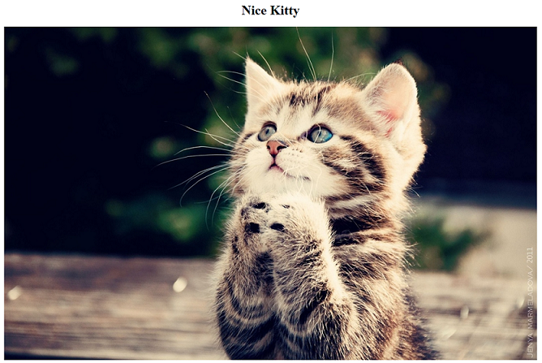

# 课程:创建一个简单的网页并将其添加到IPFS中

这节课向你展示了如何创建一个简单的网页并将其添加到IPFS中。一旦你能够做到这一点，你就可以使你的网页按照你想要的那样漂亮或复杂，并使用相同的基本命令将它们添加到IPFS中。

## 先决条件

要做到这一课的步骤，你必须:

* 在本地机器上安装和初始化IPFS

## 目标

学习完这节课，你就能

* 创建一个简单的网页并将其添加到IPFS中

## 步骤

### 步骤1:启动IPFS daemon

如果IPFS daemon还没有运行，那么现在就启动这个daemon

```bash
$ ipfs daemon
```

### 步骤2:创建网页目录和内容

在用户的家目录中创建一个新的网页目录。

```bash
$ cd ~  (or cd %userprofile% on Windows)
$ mkdir simple-webpage
$ cd simple-webpage/
```

使用ipfs下载这张漂亮的小猫图片

```bash
$ ipfs cat QmW2WQi7j6c7UgJTarActp7tDNikE4B2qXtFCfLPdsgaTQ/cat.jpg > cat.jpg
```

使用一个文本编辑器，创建一个名为`index.html`的文件，并复制/粘贴以下内容

```bash
<!DOCTYPE html>
<html>
<head>
  <title>Nice Kitty</title>
</head>
<body>
  <center>
  <h1>Nice Kitty</h1>
  
  </center>
</body>
</html>
```

在`simple-webpage`目录中保存`index.html`并关闭文本编辑器。如果你愿意，你可以在浏览器中打开`index.html`来查看网页。



这个简单的网页只有两个文件，`index.html`和`cat.jpg`。现在你将把`simple-webpage`目录添加到IPFS中：

```bash
$ cd ..
$ ipfs add -r simple-webpage/
```

你应该看到如下所示的输出：

```bash
added Qmd286K6pohQcTKYqnS1YhWrCiS4gz7Xi34sdwMe9USZ7u simple-webpage/cat.jpg
added QmNiBYXmgwLvT4xBiL8cX9j5H3AckiEjAnLZsoBiK6xEEr simple-webpage/index.html
added QmZhCL5rkWjH4MotDxKHUDaUESEKhTxSE7Xr16zwe59sjT simple-webpage
 432.98 KiB / 432.98 KiB [=============================================] 100.00%
```

注意，你使用带`-r`选项的命令`ipfs add`来告诉IPFS递归地添加目录的内容。

## 解释

你可以在本地创建一个网页，然后将其添加到IPFS中。当你将网页目录内容添加到IPFS时，可以使用带-r选项的ipfs add将目录中的所有文件递归添加到IPFS中。

## 接下来的步骤

继续下一课，学习如何[使用IPFS查看你的网页并发布到IPNS上](view-and-publish.md)

