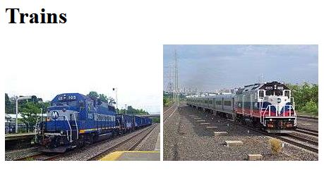

# 生成和使用一个新的IPNS名称Keypair

本课将向你展示如何生成一个新的名称keypair，并使用它发布一个与你的原始Peer ID不同的IPNS页面。

## 目标

学习完这节课，你就能

* 生成一个新的名称keypair，并将其与IPNS一起使用。

## 步骤

### 步骤1:生成一个新的名称keypair

假设你想要创建一个名为“trains”的新名称keypair。运行以下命令:

```bash
$ ipfs key gen --type=rsa --size=2048 trains
```

输出应该是类似于下面的哈希

```bash
QmexZbauipkBBrV8vZv8WjeYe8F7ojCm4UZXuAhxk5vFF1
```

现在你可以列出你在本地节点上的密钥:

```bash
$ ipfs key list
self
trains
```

注意，“self”是你的Peer ID的密钥对的默认名称。这个密钥对在你`ipfs name publish`而没有指定名称时使用。

### 步骤2:创建新的网页目录和内容

在用户的家目录中为trains创建一个新的网页目录。

```bash
$ cd ~  (or cd %userprofile% on Windows)
$ mkdir trains-webpage
$ cd trains-webpage/
```

使用ipfs下载2张火车图片

```bash
$ ipfs cat QmXoypizjW3WknFiJnKLwHCnL72vedxjQkDDP1mXWo6uco/I/m/MNRR_maintenance_train_at_Beacon.jpg > train1.jpg
$ ipfs cat QmXoypizjW3WknFiJnKLwHCnL72vedxjQkDDP1mXWo6uco/I/m/New_Jersey_Transit_train_53_to_Port_Jervis.jpg > train2.jpg
```

使用一个文本编辑器，创建一个名为`index.html`的文件，并复制/粘贴以下内容

```bash
<!DOCTYPE html>
<html>
<head>
  <title>Trains</title>
</head>
<body>
  <h1>Trains</h1>
  
  
</body>
</html>
```

在`trains-webpage`目录中保存`index.html`并关闭文本编辑器。如果你愿意，你可以在浏览器中打开`index.html`来查看网页。



### 第三步:将你的网页添加到IPFS和IPNS中

现在你可以将你`trains-webpage`目录添加到IPFS中

```bash
$ cd ..
$ ipfs add -r trains-webpage/
```

你应该看到如下所示的输出

```bash
added QmWq1TLwLiem1R66oDGeqgvNhVqMQp2pTH45ccMDKgqiSD trains-webpage/index.html
added QmRiSPSMK1nC3adhL1N1o2CWLGve6iUMijikmsVbAh5gt4 trains-webpage/train1.jpg
added QmZqx5XsHhU5qGoWXPgqa8EHRh8JRCCCQPudp1MJcVERTG trains-webpage/train2.jpg
added QmTVgwpmruEWN8Dyx71FnBzymxfs8B5qV9Wuy8W4NZehPB trains-webpage
 13.97 KiB / 13.97 KiB [===============================================] 100.00%
```

从前面的课程中，你知道你可以使用上面最后一行的哈希来查看你的网页(注意，你自己的哈希可能会不同):

`https://ipfs.io/ipfs/QmTVgwpmruEWN8Dyx71FnBzymxfs8B5qV9Wuy8W4NZehPB`

现在，你可以 **使用新的“trains”密钥对** 和trains-webpage/目录的哈希来将你的trains网页发布到IPNS上:

```bash
$ ipfs name publish --key=trains QmTVgwpmruEWN8Dyx71FnBzymxfs8B5qV9Wuy8W4NZehPB
```

你应该看到如下所示的输出

```bash
Published to QmexZbauipkBBrV8vZv8WjeYe8F7ojCm4UZXuAhxk5vFF1:
/ipfs/QmTVgwpmruEWN8Dyx71FnBzymxfs8B5qV9Wuy8W4NZehPB
```

请注意，上面的“Published to”哈希是你在该页顶部创建的新名称密钥对“trains”的哈希。

使用你的“trains”哈希的IPNS链接查看新网页:

`https://ipfs.io/ipns/QmexZbauipkBBrV8vZv8WjeYe8F7ojCm4UZXuAhxk5vFF1`

使用前面所学的相同步骤更新此网页，添加到IPFS中，并重新发布到IPNS中。

## 解释

你可以在任何时候生成一个用于IPFS/IPNS工作的新名称密钥对。这将允许你使用除了你的primary Peer ID之外的多个密钥对。

## 接下来的步骤

接下来，进入[Merkle树和IPFS DAG](../ipfs-dag/)教程。

